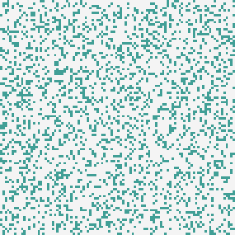

# Conway's Game of Life
The [game_of_life.py](game_of_life.py) script in this directory calculates new generations of
"dead" and "alive" cells according to the rules of the famous cellular automaton. Only a small
part of the script is related to the actual rules for calculating a new generation:

```python
kernel = np.array([
        [1, 1, 1],
        [1, 0, 1],
        [1, 1, 1],
    ], dtype=np.uint8)
nr_alive_cells = lfr.focal_sum(generation, kernel)
underpopulated = nr_alive_cells < 2
overpopulated = nr_alive_cells > 3
reproducing = nr_alive_cells == 3
generation = lfr.where(generation, ~(underpopulated | overpopulated), reproducing)
```

Such a script can be written and read by anybody with some experience with map algebra or array
algebra. Note that bitwise operators are being used for performing logical operations: `~` is
logical not, `|` is logical or (and `&` is logical and). In Python it is not possible to overload
`not`, `or`, and `and`.

Even though the script looks like any map algebra or array algebra script, the calculations
are performed in parallel using a user-defined number of CPU cores (by default all of them). Also,
computations continue at the same time as I/O is being performed.

In case you are interested in calculating generations for very, very large arrays then you can. LUE
scripts run unchanged on a standard MPI cluster.

See also:
- https://en.wikipedia.org/wiki/Conway's_Game_of_Life


