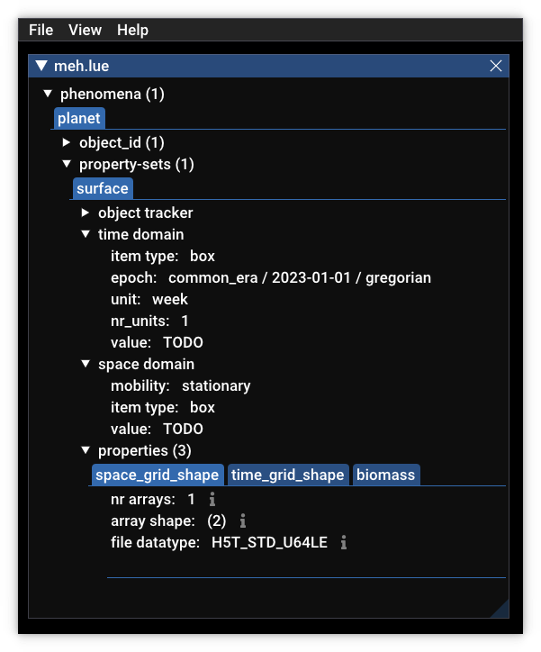

# Merge raster

A model built with LUE can run on parallel hardware and on distributed memory systems. Reading
and writing data from and to datasets happens as if such a model runs on a single CPU core
using a single process, like in the old days.

But, in case of a model that is not capable of scaling over parallel hardware and distributed
memory systems, a common way of handling the I/O is to use multiple processes, each performing
calculations for a certain spatial extent, and use a set of datasets per process. Afterwards,
these datasets are merged together again for further analysis of the model output.

In this example we are illustrating how model outputs for running a model for different spatial
extents can be merged in a single LUE dataset, formatted according to the LUE data model.

A LUE dataset is a standard portable HDF5 file in which all data related to a model can be stored.
In this example we are only storing a single temporal stack of rasters (a "data cube"), but the
example can be expanded to store multiple of those, and static rasters, and mobile point data,
for example.

