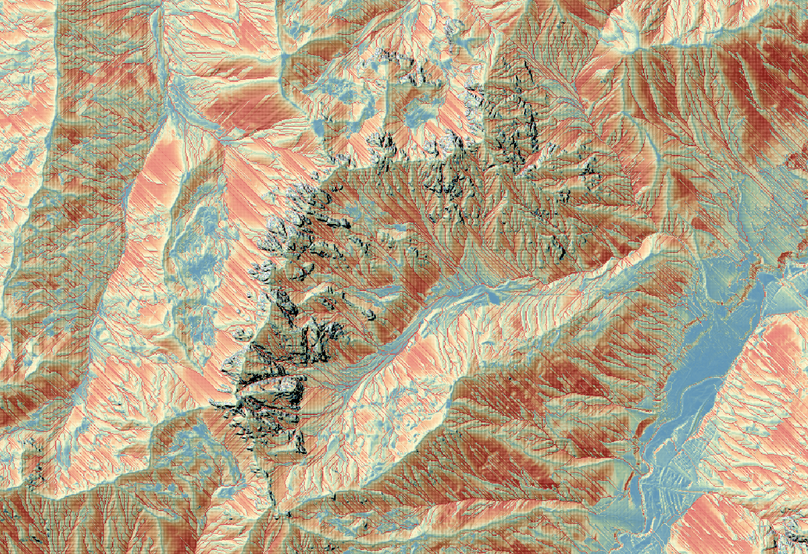

# Universal Soil Loss Equation
The [usle.py](usle.py) script in this directory calculates the average anual soil loss, using the USLE
equation. The goal is to show off how the LUE framework can be used to perform the necessary
calculations. Given enough hardware, LUE will perform the calculations in parallel.
For very large problem sizes, LUE can use multiple distributed cooperating processes. There is
no need to change the [usle.py](usle.py) script for that. See [usle-desktop.sh](usle-desktop.sh)
for an example of running the script on a single computer.

Note how the statement for calculating the anual soil loss in [usle.py](usle.py) matches the
one from the literature:

$$A = R * K * L * S * C * P$$

With:

- $A$: Long-term average annual soil loss
- $R$: Rainfall erosivity factor
- $K$: Soil erodibility factor
- $L$: Topographic factor: slope length
- $S$: Topographic factor: slope gradient
- $C$: Cropping management factor
- $P$: Conservation practices factor

In [usle.py](usle.py), various kinds of operations are combined:

- Local operations, in which a new value for an output raster cell depends on one or more input
  raster cells at the same location in space. Examples: `divide`, `multiply`.
- Focal operations, in  which a new value for an output raster cell depends on a neighbourhood
  of cells around an input raster cell at the same location in space. Example: `slope`.
- Flow direction network operations, in which a new value for an output raster cell depends on
  raster cells that can be reached via the flow direction network. Example: `accu_threshold`.

Whenever useful and possible, LUE schedules calculations from multiple operations for execution
at the same time.

See also:
- https://lue.computationalgeography.org
- https://en.wikipedia.org/wiki/Universal_Soil_Loss_Equation

")

Digital elevation model from [Land Tirol - data.tirol.gv.at](https://data.tirol.gv.at),
licensed according to [CC BY 4.0](https://creativecommons.org/licenses/by/4.0/deed.en)
